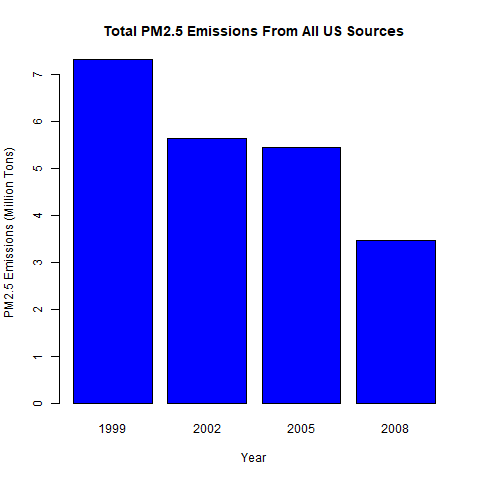
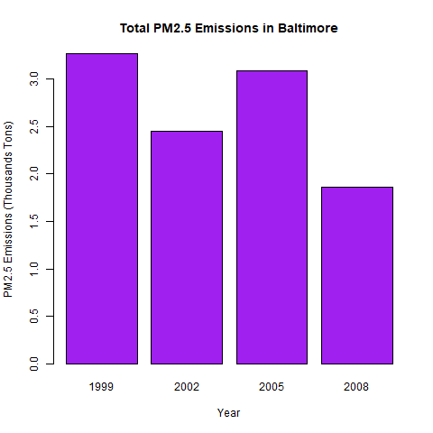
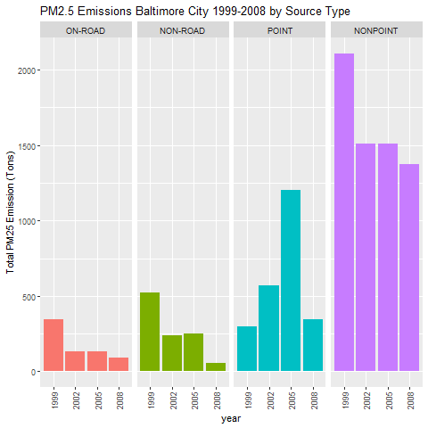
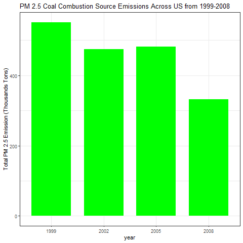
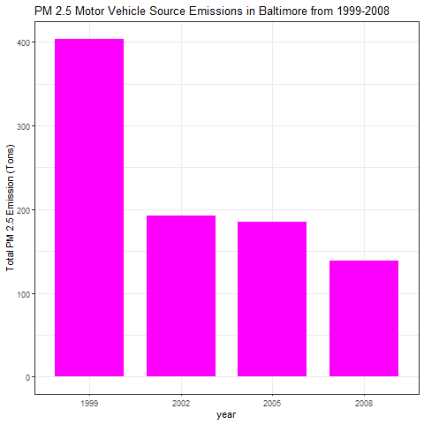
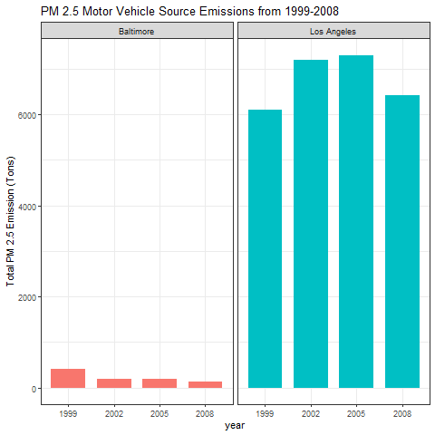

# Exploratory Data Analysis Project 2

## Introduction

This assignment uses data from
the <a href="http://www.epa.gov/ttn/chief/eiinformation.html">EPA National Emissions Inventory web site</a>
For each year and for each type of PM source, the NEI records how many tons of PM2.5 were emitted from that source over the course of the entire year. The data that you will use for this assignment are for 1999, 2002, 2005, and 2008.

The data for this assignment are available from the course web site as a single zip file:
* <b>Dataset</b>: <a href="https://d396qusza40orc.cloudfront.net/exdata%2Fdata%2FNEI_data.zip">Data for Peer Assessment </a> [29Mb]

## Questions
* 1. Have total emissions from PM2.5 decreased in the United States from 1999 to 2008? Using the base plotting system, make a plot showing the total PM2.5 emission from all sources for each of the years 1999, 2002, 2005, and 2008.

As we can observe, total emissions have decreased in the US from 1999 to 2008

* 2.Have total emissions from PM2.5 decreased in the Baltimore City, Maryland (\color{red}{\verb|fips == "24510"|}fips == "24510") from 1999 to 2008? Use the base plotting system to make a plot answering this question.

**As we can see from the graph below, there is a decrease from the year 1999 to the year 2008 in total PM2.5 emissions in Baltimore City; With a exception in 2005**

* 3.Of the four types of sources indicated by the ttype (point, nonpoint, onroad, nonroad) variable, which of these four sources have seen decreases in emissions from 1999–2008 for Baltimore City? Which have seen increases in emissions from 1999–2008? Use the ggplot2 plotting system to make a plot answer this question.

**onroad, nonroad, and nonpoint sources have all seen decreases in PM2.5 emissions from 1999-2008. Point sources have seen an increase over the same time period**

* 4.Across the United States, how have emissions from coal combustion-related sources changed from 1999–2008?

**Emissions from coal combustion-relates sources have decreased from 1999-2008, especially from 2005 to 2008.**

* 5.How have emissions from motor vehicle sources changed from 1999–2008 in Baltimore City?

**Emissions from motor vehicle sources have declined from 1999-2008 in Baltimore City.**

* 6. Compare emissions from motor vehicle sources in Baltimore City with emissions from motor vehicle sources in Los Angeles County, California (fips == "06037"). Which city has seen greater changes over time in motor vehicle emissions?

**During this period of time (1999-2008) Baltimore City had reduced their emissions, but Los Angeles City had suffer an increase in their emissions**

